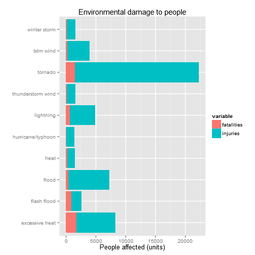
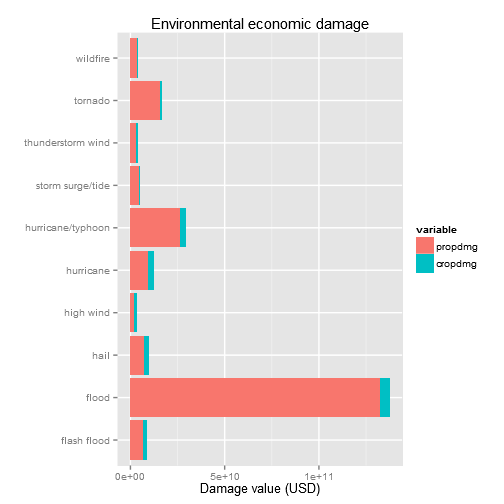

# Synopsis

This report analyses data from the NOAA Storm Database to answer the following questions:

1. Across the United States, which types of events (as indicated in the EVTYPE variable) are most harmful with respect to personal health?
2. Across the United States, which types of events have the greatest economic consequences?

According to this analysis, the most dangerous events to people are tornadoes, while floods have the highest economic impact.

# Data Processing

Due to a radical change in the way NOAA records data which started on January 1996 ([source](http://www.ncdc.noaa.gov/stormevents/details.jsp)), the author decided to carry out this analysis only on values collected on and after January 1st, 1996.

*Note: There is spelling and naming variation across events in the EVTYPE variable. The top 10 causes of personal and economic damage, which are the focus of this analysis, are barely affected by this. Therefore the author kept the EVTYPE variable value untouched.*

First we load the libraries we will be needing for the analysis.


```r
library(car)
library(reshape2)
library(ggplot2)
```

We check whether the data set is already in the current working directory and, if not, we download it.


```r
file.url <- "https://d396qusza40orc.cloudfront.net/repdata%2Fdata%2FStormData.csv.bz2"
file.local <- "StormData.csv.bz2"
if(!file.exists(file.local)) {
    download.file(file.url, file.local, "curl")
}
```

We load the data set into the local environment. We also change all content to lowercase in order to make the content easier to work with from a coder's perspective.


```r
df <- read.csv(file.local, stringsAsFactors = FALSE)
names(df) <- tolower(names(df))
df$evtype <- tolower(df$evtype)
```

We drop all fields that are not relevant to this analysis, leaving only data related to:

- Date
- Event type
- Fatalities
- Injuries
- Damage to property
- Damage to crops


```r
df <- df[, c("bgn_date", "evtype", "fatalities", "injuries", "propdmg",
             "propdmgexp", "cropdmg", "cropdmgexp")]
```

We clean all data previous to 1996 due to the changes in the data collection methodology outlined above.


```r
df$bgn_date <- as.Date(df$bgn_date, format = "%m/%d/%Y %H:%M:%S")
df <- df[df$bgn_date > as.Date("1995-12-31"), ]
```

We change the values in the fields related to property and crop damage to a consistent format, then we drop the columns we will not be using for the remaining part of the analysis.


```r
exp.list.prop = "'0'=1;'1'=10;'2'=100;'3'=1000;'4'=10000;'5'=100000;'6'=1000000;
                '7'=10000000;'8'=100000000;'B'=1000000000;'h'=100;'H'=100;
                'K'=1000;'m'=1000000;'M'=1000000;'-'=0;'?'=0;'+'=0"
exp.list.crop = "'0'=1;'2'=100;'8'=100000000;'k'=1000;'K'=1000;'B'=1000000000;
                'm'=1000000;'M'=1000000;'?'=0"
df$propdmg <- df$propdmg * as.numeric(recode(df$propdmgexp, exp.list.prop))
df$cropdmg <- df$cropdmg * as.numeric(recode(df$cropdmgexp, exp.list.crop))
df <- df[ , -c(1, 6, 8)]
```

All events with no consequences to personal safety or property damage are excluded.


```r
df <- subset(df, df$fatalities + df$injuries != 0 |
                 df$propdmg + df$cropdmg != 0)
```

We isolate the top 10 causes of damage to people and to property.


```r
# Isolate top 10 events for personal damage
personal.dmg <- subset(df, df$fatalities + df$injuries != 0)[ , 1:3]
personal.dmg$count <- apply(personal.dmg[ , 2:3], 1, sum)
personal.dmg <- aggregate(. ~ evtype, personal.dmg, sum)
personal.dmg <- head(personal.dmg[order(-personal.dmg$count), ], 10)

# Isolate top 10 events for economic damage
economic.dmg <- subset(df, df$propdmg + df$cropdmg != 0)[ , c(1, 4, 5)]
economic.dmg$count <- apply(economic.dmg[ , 2:3], 1, sum)
economic.dmg <- aggregate(. ~ evtype, economic.dmg, sum)
economic.dmg <- head(economic.dmg[order(-economic.dmg$count), ], 10)
```

Now the data is clean and processed and can be used to draw results.

# Results

## Personal damage

To understand the impact of natural events to personal safety, we look at the top 10 events that cause fatalities and injuries.


```r
personal.dmg
```

```
##                evtype fatalities injuries count
## 102           tornado       1511    20667 22178
## 22     excessive heat       1797     6391  8188
## 30              flood        414     6758  7172
## 68          lightning        651     4141  4792
## 105         tstm wind        241     3629  3870
## 29        flash flood        887     1674  2561
## 99  thunderstorm wind        130     1400  1530
## 121      winter storm        191     1292  1483
## 42               heat        237     1222  1459
## 58  hurricane/typhoon         64     1275  1339
```

Tornadoes are by far the most impactful.


```r
# Plot personal damage
personal.dmg <- melt(personal.dmg, id.vars = "evtype",
                     measure.vars = c("fatalities", "injuries"))
ggplot(personal.dmg, aes(x = evtype, y = value, fill = variable)) +
    geom_bar(stat = "identity") + coord_flip() +
    labs(title = "Environmental damage to people",
         x = "", y = "People affected (units)")
```

 

## Economic damage

To understand the economic consequences of natural events, we look at the top 10 events that cause the greatest economic damage to property and to crops.


```r
# Print economic damage
economic.dmg
```

```
##               evtype   propdmg   cropdmg     count
## 17             flood 1.325e+11 4.793e+09 1.373e+11
## 32 hurricane/typhoon 2.674e+10 2.608e+09 2.935e+10
## 52           tornado 1.603e+10 2.778e+08 1.631e+10
## 31         hurricane 9.716e+09 2.688e+09 1.240e+10
## 24              hail 7.602e+09 1.729e+09 9.331e+09
## 16       flash flood 7.094e+09 1.308e+09 8.402e+09
## 49  storm surge/tide 4.641e+09 8.500e+05 4.641e+09
## 51 thunderstorm wind 3.383e+09 3.983e+08 3.781e+09
## 62          wildfire 3.498e+09 1.861e+08 3.684e+09
## 30         high wind 2.425e+09 6.319e+08 3.057e+09
```

Floods cause the highest economic damage of all event types.


```r
# Plot economic damage
economic.dmg <- melt(economic.dmg, id.vars = "evtype",
                     measure.vars = c("propdmg", "cropdmg"))
ggplot(economic.dmg, aes(x = evtype, y = value, fill = variable)) +
    geom_bar(stat = "identity") + coord_flip() +
    labs(title = "Environmental economic damage",
         x = "", y = "Damage value (USD)")
```

 

# External resources
- <https://ire.org/nicar/database-library/databases/storm-events/>
- <http://www.ncdc.noaa.gov/stormevents/>
